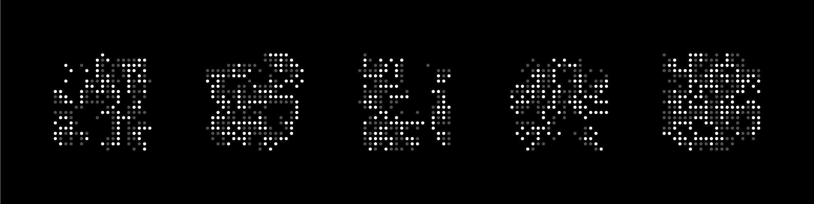

# Gogogo

## Overview

Reads in Go games recorded in `.sgf` format and produces an SVG of the final positions in each game provided.

Created to reproduce to the sweet graphic used at the end of Netflix's AlphaGo documentary.

## Getting Started

Clone the project and run the installation using `npm install`.

You can run the project with the default configuration like so:

```{bash}
$> npm start
```

By default the project pulls in the 5 games between AlphaGo and Lee Sedol.

### Configuration

You can create and run other configurations by passing in an argument:

```{bash}
$> npm start -- -c ./config/mint.config.js
```

If you want to run this project on other `.sgf` files, you can use them like so:

```{bash}
# Default configuration
$> node bin/draw.js <file name> <file name> <file name> ...

# Custom configuration
$> node bin/draw.js -c <path to config file> <file name> <file name> <file name> ...
```

## Samples

### Close-ish approximation of the Netflix graphic


### Green is cool

